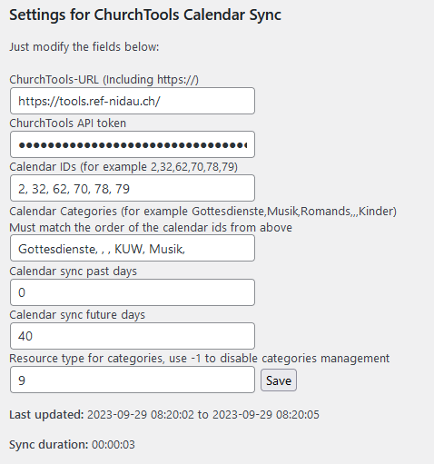

# churchtools-wp-calendarsync
This wordpress plugin does take the events from the churchtools calendar
and imports them as events in wordpress.

Updates to the events in churchtool are also updated in wordpress.

**For this plugin to be working, you need to also install and**
**configure the "Events Manager" from Pixelite**

https://de.wordpress.org/plugins/events-manager/

## Features
- Sync calendar entries from selected calendars to wordpress
- Assign categories based on source calendar
- Event categories can be assigned via churchtool resources
- The title, description and location are synced to wordpress
- The image of the calendar entry is synced to wordpress
- Support for all-day events
- Sync window is specified by n days in the past and m days in the future
- Uses the modern REST api of churchtools
- Creates logfile in the plugin folder, configurable log levels

### Room for improvement (and/or missing features)
- Build wordpress package via github actions
- Handle recurrence of events (perhaps)
- Configure log level from wordpress UI
- Show log in wordpress UI
- Take event information over to wordpress
- Resize large images to match template thumbnail sizes
- Simpler configuration of the plugin (More workflow and more robust)
- Fetch token via UI login/api call to churchtool
- Notify someone about sync problems
- Better error handling in the sync process
- Link config screen directly from plugins list
- When an image is removed in churchtools, then remove it in wordpress too
  (Replacing images already works)
- Make plugin (and updates) available via wordpress plugins site

### Reason for this way of integration
One of biggest advantages of this approach is the fact,
that you can use all the events manager features, formatting
listing, ical feed etc. out of the box.

You can also add other events directly in wordpress
event manager, the church tool sync process will not touch these.

## Installation of the plugin
- Make sure to have the events manager plugin installed and activated
- Download the plugin from https://github.com/a-schild/churchtools-wp-calendarsync/releases
- Upload and activate it in your wordpress installation

## Configuration of the plugin
- We recommend to create a ctsync or similar wp account,
  so all events get this user assigned as the owner.
  The cron job uses the one logged in, which did activate the plugin
- Get the url to your churchtool installation
- Get a API token, which has read access to the desired calendars
- Go to the wordpress admin page
- Activate the plugin
- Navigate to "Settings->Churchtools Calendar sync
  
- Enter your values and hit save, a first sync cycle will start, so be patient
- After the sync cycle is finished, the last sync and the sync duration are displayed
- Now the sync is started every 60 minutes

## Finding calendar and resource ID's
You have to put in the calendar ID's for the
calendars to sync.
If you also wish to set the event categories based on
resource bookings, then you need the resource type ID.

These ID's are hard to get from your churchtool installation.
You can use the project mentioned below, to list
all calendars and resources the user has access to.

https://github.com/a-schild/churchtools-calendarlocations

- Check out the code on a workstation (Not the wp server)
- Copy config.sample.json to config.json
- Add your CT URL and the API key to config.json
- And then use these commands:
```
npm install
node main.js -c
node main.js -r
```

## Tips and tricks
- Event categories can be taken from churchtool
  - For this, create a new resource type like "Website categories"
  - Add all categories as resource with the given type and name
  - Mark the resource as virtual, so no booking conflicts occure
  - Mark the resource to automatically accept bookings
- You can organize the event categories (Once created by the sync process)
  in hierarchical way in wordpress
  - The sync process only looks at the category name for matching
- The wp-cron job runs every hour
  - If you wish to trigger it manually, you can install this plugin
    https://wordpress.org/plugins/wp-crontrol/
  - You can also see who is associated with the cron job, and will
    be the owner of the event entries
- Use a seaparate wordpress user for installing and configuring the 
  plugin. This way, the owner of the new events will be that user
  and you can see who created them

(c) 2023 Aarboard a.schild@aarboard.ch
